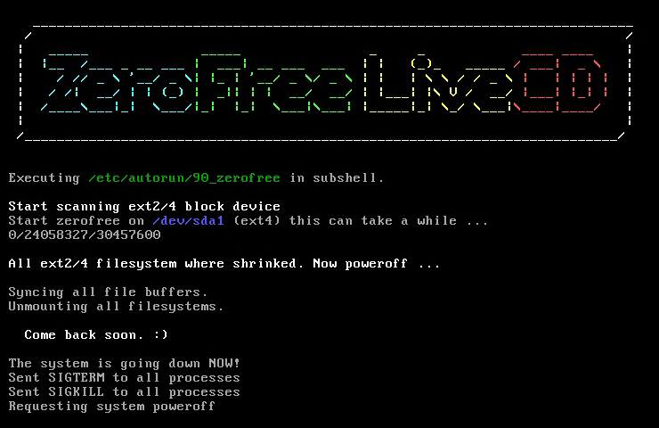

zerofree LiveCD
===============



What is it ?
------------

This is a small bootable CD to run the zerofree command on all
ext2/ext4 partitions on a machine. This is particularly useful for
reducing the export size of a VM.

It is based on [Minimal Linux Live](https://github.com/ivandavidov/minimal).


How to use ?
------------

```bash
# Insert the disk into VM
VBoxManage storageattach <vm_name> --storagectl "IDE Controller" \
           --port 1 --device 0 --type dvddrive --medium zerofree-livscd.iso
# Boot on CD
VBoxManage modifyvm <vm_name> --boot1 dvd --boot2 disk --boot3 none --boot4 none
# Start VM and wait for shutdown (this can take a while)
VBoxManage startvm <vm_name> --type headless
```


License
-------

This program is free software; you can redistribute it and/or modify
it under the terms of the GNU General Public License as published by
the Free Software Foundation; either version 3 of the License, or (at
your option) any later version.

It is a derivative work of [Minimal Linux Live](https://github.com/ivandavidov/minimal)
which is licensed under the GNU General Public License.
